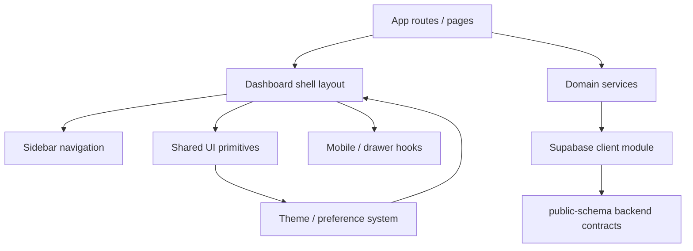

# Report: Platform Office Migration Roadmap

**Agent:** GitHub Copilot (MAI-Code-1-Flash)  
**Date:** 2026-07-15  
**Task Type:** Migration  
**Domain:** migration

---

## 1. Executive Summary

This roadmap converts the current admin-dashboard-style repository into the Platform Office defined by the Platform Office PRD without widening the scope beyond the public-schema observability contract. The repository already contains reusable shell, theming, layout, and drawer primitives, but the migration must still decommission template-era navigation, enforce the service-layer isolation boundary, and integrate mobile-first workflows before the application can be treated as Platform Office-ready.

---

## 2. Task Scope

This roadmap is limited to the migration work implied by the Platform Office PRD and the repository audit evidence. It uses the Multi-Tenancy PRD as architectural context only and does not expand the migration scope to tenant business-data features, ERP permissions, or non-platform data access.

---

## 3. Methodology

The roadmap was derived from direct repository inspection and the product contract:

- Reviewed [AGENTS.md](AGENTS.md) for repository guardrails and reporting rules.
- Used [docs/PRD/platform-office-prd.md](docs/PRD/platform-office-prd.md) as the implementation contract.
- Used [docs/PRD/multi-tenancy-prd-v2.1.md](docs/PRD/multi-tenancy-prd-v2.1.md) as context only, with scope constrained to public-schema observability and platform operations.
- Inspected the current repository structure and key implementation anchors, especially navigation, the shared shell, mobile utilities, and database access patterns.

---

## 4. Repository Dependency Graph

The current repository already has a layered dependency structure that can be repurposed for the Platform Office. The migration should preserve this structure while changing the business intent of the layers.



### 4.1 Dependency map by repository area

- Routing and shell:
  - [src/app/(main)/dashboard/layout.tsx](src/app/(main)/dashboard/layout.tsx)
  - [src/app/(main)/dashboard/_components/sidebar/app-sidebar.tsx](src/app/(main)/dashboard/_components/sidebar/app-sidebar.tsx)
  - [src/navigation/sidebar/sidebar-items.ts](src/navigation/sidebar/sidebar-items.ts)

- Reusable UI and interaction primitives:
  - [src/components/ui](src/components/ui)
  - [src/hooks/use-mobile.ts](src/hooks/use-mobile.ts)
  - [src/components/ui/drawer.tsx](src/components/ui/drawer.tsx)

- State and preferences:
  - [src/stores/preferences](src/stores/preferences)
  - [src/lib/preferences](src/lib/preferences)

- Data boundary and backend integration:
  - [src/lib/supabase.ts](src/lib/supabase.ts)
  - [src/app/(main)/dashboard/users/page.tsx](src/app/(main)/dashboard/users/page.tsx)
  - [package.json](package.json)

### 4.2 Dependency implications for migration

The migration is dependency-driven in three ways:

1. The shell and UI layer are already present, so the roadmap should preserve and adapt them rather than replace them.
2. The backend boundary is not yet isolated, so service-layer work is the critical dependency that unlocks the rest of the migration.
3. The dependency footprint in [package.json](package.json) is broader than the initial Platform Office scope, so pruning should happen in parallel with feature migration rather than as a final cleanup task.

---

## 5. Critical Path

The critical path is the sequence of work that must be completed before the application can meaningfully function as the Platform Office:

1. Replace the template-era navigation contract in [src/navigation/sidebar/sidebar-items.ts](src/navigation/sidebar/sidebar-items.ts) with Platform Office domains.
2. Introduce service modules under [src/lib/services](src/lib/services) and remove direct Supabase usage from presentational layers.
3. Repoint the dashboard screens to read only from the approved public-schema observability contract.
4. Adapt the shell and destructive workflows for mobile-first operation through [src/hooks/use-mobile.ts](src/hooks/use-mobile.ts) and [src/components/ui/drawer.tsx](src/components/ui/drawer.tsx).
5. Verify the app through build/lint cycles and confirm that the public-schema-only boundary is enforced.

This sequence is critical because the navigation, service boundary, and mobile workflows are interdependent. A screen cannot be considered migrated if it still imports the Supabase client directly or still exposes non-platform routes.

---

## 6. Migration Phases

### Phase 0 — Baseline and contract freeze

**Goal:** Establish the migration boundary and preserve the current shell as the base implementation layer.

**Work items:**
- Confirm the migration scope against [docs/PRD/platform-office-prd.md](docs/PRD/platform-office-prd.md) and AGENTS guardrails.
- Treat [docs/PRD/multi-tenancy-prd-v2.1.md](docs/PRD/multi-tenancy-prd-v2.1.md) as context only, not as a source of new capabilities.
- Map the current route and layout structure under [src/app/(main)/dashboard](src/app/(main)/dashboard).

**Entry criteria:**
- The PRD contract and repository guardrails are reviewed.

**Exit criteria:**
- A migration backlog exists for navigation, services, mobile adaptation, and dependency pruning.

---

### Phase 1 — Navigation and route decommissioning

**Goal:** Replace the starter-dashboard mental model with the Platform Office operational model.

**Work items:**
- Replace the generic sidebar entries in [src/navigation/sidebar/sidebar-items.ts](src/navigation/sidebar/sidebar-items.ts) with the Platform Office domain set: Overview, Workspaces, Incidents, Audit, Health, and Settings.
- Remove template-era routes or mark them as deprecated so the shell no longer leads operators to generic admin experience.
- Reuse the existing shell layout in [src/app/(main)/dashboard/layout.tsx](src/app/(main)/dashboard/layout.tsx) rather than introducing a new layout stack.

**Evidence:**
- The current sidebar still contains CRM, Finance, Analytics, and Legacy sections, which are inconsistent with the PRD’s operational domains.

**Entry criteria:**
- Phase 0 is complete.

**Exit criteria:**
- The navigation contract matches the Platform Office information architecture and no longer advertises generic template pages.

---

### Phase 2 — Service-layer isolation and public-schema contract enforcement

**Goal:** Enforce the strict data-isolation boundary required by the PRD and AGENTS.md.

**Work items:**
- Introduce service modules under [src/lib/services](src/lib/services), such as workspace, incident, and provisioning services.
- Move all Supabase queries out of UI pages and layouts and into these services.
- Reorganize [src/lib/supabase.ts](src/lib/supabase.ts) so the UI layer depends on the service wrapper rather than on the client directly.
- Restrict queries to the approved public-schema entities defined in the PRD: public.workspaces, public.platform_operators, public.entity_provisioning_status, public.activity_events, and related observability tables.
- Keep mutations limited to the safe-action RPCs defined in AGENTS.md.

**Evidence:**
- The current users page in [src/app/(main)/dashboard/users/page.tsx](src/app/(main)/dashboard/users/page.tsx) queries workspace tables directly from the page component, which conflicts with the PRD’s service-layer rule.

**Entry criteria:**
- Navigation decommissioning is complete enough to establish the target route structure.

**Exit criteria:**
- No presentational route imports the Supabase client directly and all data access flows through domain services.

---

### Phase 3 — Operator-centric screen migration

**Goal:** Replace starter views with Platform Office workflows aligned to the PRD.

**Work items:**
- Migrate dashboard screens to the operational domains from the PRD: overview, workspace lifecycle, incidents, provisioning health, audit, and settings.
- Keep feature code colocated near its route, in line with AGENTS.md.
- Add loading, empty, and error states for slow or failing backend access.
- Preserve the existing high-density operations-console style rather than reverting to marketing-style spacing.

**Evidence:**
- The current repository is still organized around a general admin dashboard experience rather than a platform operations console.

**Entry criteria:**
- The service boundary is active and stable.

**Exit criteria:**
- The main routes reflect the intended operator workflows and are backed by services rather than direct database access.

---

### Phase 4 — Mobile-first workflow integration

**Goal:** Ensure every critical operator workflow is usable on mobile and touch interfaces.

**Work items:**
- Add safe-area-aware spacing in [src/app/(main)/dashboard/layout.tsx](src/app/(main)/dashboard/layout.tsx) so mobile notches and bottom gesture areas are handled gracefully.
- Reuse [src/hooks/use-mobile.ts](src/hooks/use-mobile.ts) and [src/components/ui/drawer.tsx](src/components/ui/drawer.tsx) to transform dialogs into drawer/sheet surfaces on small viewports.
- Ensure approval, suspension, archive, and recovery workflows are touch-friendly and avoid hover-only interactions.
- Preserve 44x44 CSS pixel touch targets and avoid mouse-only affordances.

**Evidence:**
- The repo already includes a mobile hook and a drawer component, so the migration should adapt existing primitives rather than add a new mobile stack.

**Entry criteria:**
- The primary screens and actions exist in the new domain structure.

**Exit criteria:**
- Core operator workflows are usable on mobile viewports without losing critical affordances.

---

### Phase 5 — Dependency pruning and simplification

**Goal:** Reduce the dependency footprint to what the Platform Office MVP truly needs.

**Work items:**
- Review [package.json](package.json) and remove or defer packages that are not actively required by the Platform Office shell or the local UI primitives.
- Prioritize reuse of the existing UI layer in [src/components/ui](src/components/ui) rather than introducing new dependencies.
- Defer non-essential visualization or calendar dependencies until explicit product requirements justify them.

**Evidence:**
- The dependency inventory includes packages such as FullCalendar, D3/TopoJSON, Temporal, and DnD Kit, which appear heavier than the initial Platform Office scope requires.

**Entry criteria:**
- The core routes and services are in place.

**Exit criteria:**
- The dependency set aligns with the Platform Office shell and interaction model, with no obvious drag from unused template-era packages.

---

## 7. Phase Dependencies

The migration is best executed as a staged sequence rather than a single big-bang rewrite:

- Phase 1 depends on the shell and route structure already present in the repository.
- Phase 2 depends on the route structure from Phase 1 because services must be wired to the target screens.
- Phase 3 depends on Phase 2 because screens should not be reworked until their data access is routed through services.
- Phase 4 depends on the existence of the workflows created in Phase 3.
- Phase 5 can run in parallel with Phase 3 and Phase 4, but it should not be treated as a standalone cleanup task.

### Parallel vs sequential work

- Sequential:
  - Navigation replacement before service wiring.
  - Service isolation before screen migration.
  - Mobile adaptation after the core workflows exist.

- Parallelizable:
  - Dependency pruning can happen alongside screen migration.
  - Mobile interaction patterns can be designed while the service boundary is being implemented.
  - Documentation and test/verification planning can run in parallel with implementation work.

---

## 8. Entry and Exit Criteria

### Entry criteria for the overall migration

- The repository structure is understood.
- The PRD contract is accepted as the authoritative implementation scope.
- The guardrails in AGENTS.md are known and respected.

### Exit criteria for the overall migration

- The navigation, screens, services, and mobile workflows align with the Platform Office PRD.
- No presentational component imports the Supabase client directly.
- All data access is limited to the public-schema observability contract and approved RPCs.
- The application is buildable and lintable with the existing stack.
- The user experience is mobile-first and operator-centric rather than template-based.

---

## 9. Mobile-First Integration Throughout the Migration

Mobile-first requirements are not an afterthought; they should be integrated at each phase:

- During Phase 1, ensure the new navigation is touch-friendly and does not rely on hover-only states.
- During Phase 2, keep the data flow and loading states compact and resilient for small viewports.
- During Phase 3, make every workflow usable in dense card or list layouts rather than assuming desktop tables alone.
- During Phase 4, convert destructive operations to drawer/sheet patterns on mobile using the existing drawer wrapper.
- During Phase 5, avoid introducing mobile-irrelevant dependencies or layouts.

This is directly aligned with the PRD’s requirement that critical operator workflows be fully executable on mobile viewports and that safe-area handling be implemented in the shell.

---

## 10. High-Risk Areas

### 10.1 Data isolation regression

Risk: a screen or helper accidentally reads tenant-schema data or uses the Supabase client directly.

Mitigation:
- Enforce the service-layer rule from the PRD.
- Define services as the only permitted database boundary.
- Review new queries against the public-schema allowlist.

### 10.2 Scope creep from the Multi-Tenancy PRD

Risk: the migration expands into ERP business workflows or tenant-specific permissions.

Mitigation:
- Keep the migration limited to platform operations and observability.
- Treat the Multi-Tenancy PRD as context only and do not introduce new workspace business features or direct data inspection screens.

### 10.3 Mobile workflow regressions

Risk: the mobile shell becomes inconsistent or destructive actions remain desktop-only.

Mitigation:
- Use the existing mobile hook and drawer primitive.
- Validate approval, suspension, archive, and recovery actions on small viewports.

### 10.4 Dependency bloat

Risk: the migration inherits too much of the starter-dashboard dependency surface.

Mitigation:
- Prune dependencies as part of the migration, not as a deferred cleanup task.
- Reuse the local UI primitives first.

---

## 11. Future Considerations (Outside the Current Migration)

Some items are explicitly relevant to the Platform Office direction but are not part of the initial migration scope:

- MFA step-up and console session policy enforcement.
- The public.platform_incidents table and richer incident workflows.
- Broader entitlement overrides and billing-related controls.
- Advanced audit correlation beyond the initial public.activity_events contract.

These items should be tracked separately as future work after the current migration establishes the public-schema service boundary and the core operations shell.

---

## 12. Raw Evidence / References

- [AGENTS.md](AGENTS.md)
- [docs/PRD/platform-office-prd.md](docs/PRD/platform-office-prd.md)
- [docs/PRD/multi-tenancy-prd-v2.1.md](docs/PRD/multi-tenancy-prd-v2.1.md)
- [src/navigation/sidebar/sidebar-items.ts](src/navigation/sidebar/sidebar-items.ts)
- [src/app/(main)/dashboard/layout.tsx](src/app/(main)/dashboard/layout.tsx)
- [src/hooks/use-mobile.ts](src/hooks/use-mobile.ts)
- [src/components/ui/drawer.tsx](src/components/ui/drawer.tsx)
- [src/lib/supabase.ts](src/lib/supabase.ts)
- [src/app/(main)/dashboard/users/page.tsx](src/app/(main)/dashboard/users/page.tsx)
- [package.json](package.json)

---

## 13. Git Status

**Before:** N/A

**After:**

```text
?? docs/Reports/migration/platform-office-migration-roadmap.md
```

**Files Modified:**
- [docs/Reports/migration/platform-office-migration-roadmap.md](docs/Reports/migration/platform-office-migration-roadmap.md)

---

**Report Generated By:** GitHub Copilot  
**Report Timestamp:** 2026-07-15T00:00:00Z
